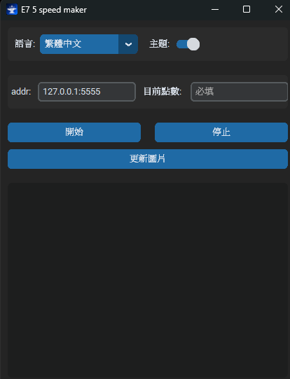
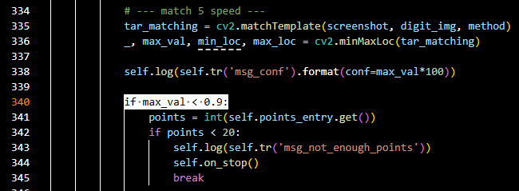
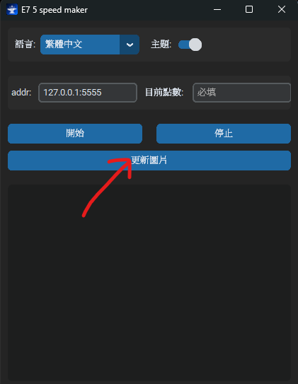
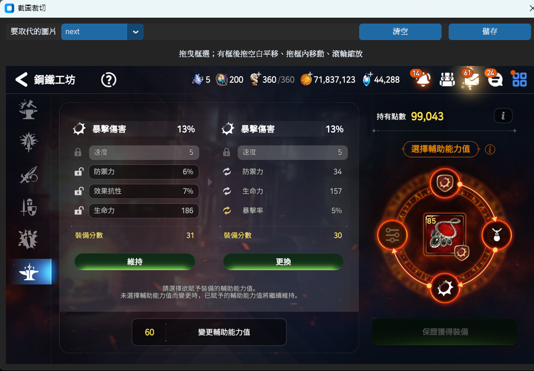

    <a href="README.md">繁體中文</a> |
    <a href="README.en.md">English</a>

# Epic Seven 5 Speed Maker

## 簡介

這是一個給第七史詩使用的小工具

以防你不知道，星之鐵鋪 (Astral Forge) 是可以刷出 5 速的，然而機率刷到速度後，僅有 0.332%，以項鍊、戒指來說，大概平均需要刷 750 次，這樣每次需要花費大量的時間與精力，甚至有時恍神還會錯過! (這比書籤嚴重多了)

這個工具就是來解決這個問題!

此工具的 GUI 是使用 customtkinter 為架構

使用 ADB 連接 bluestack，可在背景執行

根據作者與朋友的測試，目前都沒有誤判的問題，然而不保證你使用時不會有漏掉 5速 的問題，有疑慮者可以透過自行修改程式中的判斷來減少發生的可能 (理論上發生率很低)

---

## 環境

- windows 11
- Bluestack
  - 版本: 應該不影響
  - 解析度: 1920 x 1080 (解析度不同可以自行更新圖片，後面細說)
- 第七史詩
  - 我只有開 `高畫質媒體軟件` (我不確定現在還有沒有)
- python 3.12.13
- config.json
  - 你不用編輯他，並且真正的在 _internals 資料夾中
  - 所有設定你都可以透過程式中修改，不用自己修改 json 檔案
  - 除了點數，所有設定下次開啟時都會繼承

---

## 使用方式

### 啟動程式

先透過 `git clone` 、 `下載 zip` 、 `下載 E7 5 speed maker.zip`的方式，將程式下載

將 `E7 5 speed maker.zip` 解壓縮，進入 `E7 5 speed maker` 資料夾，滑鼠雙擊 `5 speed maker.exe` 即可啟動

### 語言與主題

你可以透過左上方的下拉式清單來改變語言，支援繁體中文與英文，並且語言對應遊戲中畫面的語言

你可以透過右上方的開關來切換主題顏色，支援淺色與深色

### Addr

進入程式後，先確認 addr 的 ip 正確，可以透過 bluestack 的 設定 > 進階 做查詢

#### 記得 bluestack 要啟動 ADB

### 點數

將目前的點數輸入到輸入框中

### 點擊開始

程式開始執行，開始識別並自動刷新

### 點擊停止

程式會執行最後一次刷新 (不會馬上中斷)

---

## 程式修改

該程式判斷 5 速是依照 cv2 的 `matchTemplate` 的最高信心度來判斷，預設是 `90% 以上` 為找到，如果害怕這樣太高，可以降低到 `0.85` 或是 `0.8` (調太低會常常中斷，建議最低最低就是到 0.8，你可以觀察訊息欄中輸出的最高信心都是多少，以此來判斷)

使用記事本、任何文字編輯器、IDE 開啟 `main.py` 後，修改 `line:340`，修改後執行 `pack_script.txt` 的指令重新封裝，或是此後都用 main.py 啟動程式

並且比對方式是使用 `cv2.TM_CCOEFF_NORMED`，你可以使用其他的，但不保證效果會更好，此方法是我做非常簡單的測試與比較後，選出來的

---

## 更新圖片

由於這遊戲有時會改 UI，為省去自行截圖後還要手動搬到資料夾，修改檔名，諸如此類的麻煩，該程式內建截圖、更新圖片的功能

進去後會看到 bluestack 的截圖

你可以在畫面中點擊後按壓住，放開後畫出長方形，你可以

- 透過選取框上8個點修改矩形大小
- 使用滾輪放大/縮小畫面
- 在放大畫面中，你可以透過滑鼠左鍵點擊空白處，拖移整個畫面
- 在放大畫面中，你可以透過滑鼠左鍵點擊選取框，拖移選取框
- 在放大畫面中，你可以透過滑鼠中鍵點擊，拖移整個畫面
- 點擊右上方的清空按鈕，重置選取框
- 點擊左上方的下拉式清單，更換圖片 (但這個工具只會用到一張可能UI會被修改的圖片)
- 點擊右上方的儲存按鈕，程式會根據你一開始選擇的語言，將圖片儲存

### bluestack 解析度

如果是因為平時的解析度與此工具預設不同，建議自己修改 bluestack 的解析度，如果堅持使用原本的解析度，你可以嘗試透過這個更換圖片，然後不保證 5 速的判定不被影響，後果需自行承擔，我並沒有去測試

---

## 次數

程式預設沒有上鎖，並且作為一個正常人，你如果要刷5速也不該先鎖任何屬性，因此一律當作每次花費 20

程式沒有設定最多刷幾次 (除了點數用盡)，由於本人沒這需求並且我懶了，有需要可以自行添加或 fork

---

## 注意事項

再次強調，**這種基於影像比對的技術，或多或少都會有可能錯誤，使用者應悉風險**
